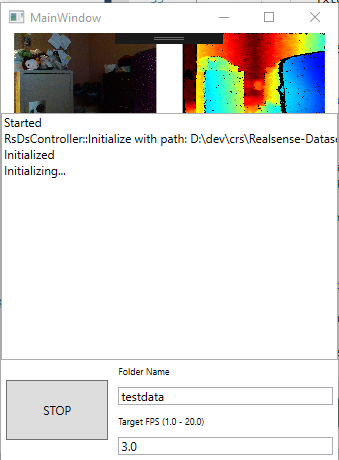

# Realsense-Dataset

WPF frontend app with CLR c++ class library to capture realsense data and export to synchronised rgb/depth image frames.

## Dependencies
- VCPKG with realsense2 and pngio projects compiled (https://github.com/Microsoft/vcpkg)
- Create an environment variable on your system called VCPKG_ROOT_X64 and VCPKG_ROOT_X86 and point it to your vcpkg installed directory.
For my x64 build mine is `D:\dev\vcpkg\installed\x64-windows\`

## The App

You can start and stop a capture and enter in your folder name that you would like to save images to

## Results
The images are saved into `"folderName"\rgb\` and `"folderName"\depth\`

